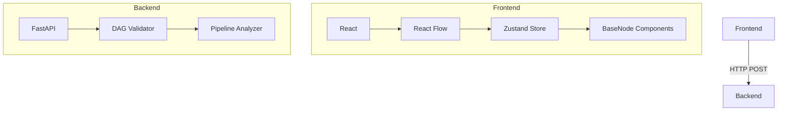

Here's a comprehensive `README.md` for your React Flow Nodes project:

```markdown
# React Flow Nodes - Workflow Builder

 *(add screenshot later)*

A visual node-based workflow builder with React Flow, featuring customizable nodes, pipeline analysis, and DAG validation.

## Features

- 🧩 **Pre-built Node Types**:
  - Input/Output nodes
  - LLM processors (GPT-3.5/4, Claude)
  - Text processing with variable detection
  - Math operations
  - API connectors
  - Conditional logic

- 🎨 **Visual Editor**:
  - Drag-and-drop interface
  - Smooth node connections
  - Dynamic node sizing
  - Responsive design

- ⚙️ **Pipeline Analysis**:
  - Node/edge counting
  - DAG validation
  - Structure visualization

- 🔌 **Extensible Architecture**:
  - Easy to add new node types
  - Backend integration ready
  - Custom styling system

## Architecture Overview



### Core Components

1. **Node System**
   - `BaseNode.js`: Abstract base component
   - Specialized nodes (LLM, Text, etc.)
   - Dynamic handle generation

2. **State Management**
   - Zustand store for pipeline state
   - Node/edge CRUD operations
   - Persistent node configurations

3. **Backend Service**
   - FastAPI endpoint (`/pipelines/parse`)
   - DAG validation using topological sort
   - Node/edge counting

## Getting Started

### Prerequisites
- Node.js (v16+)
- Python (3.8+)
- npm/yarn

### Installation
```bash
# Frontend
cd frontend
npm install

# Backend
cd backend
python -m venv venv
source venv/bin/activate  # Linux/Mac
# venv\Scripts\activate   # Windows
pip install fastapi uvicorn python-multipart networkx
```

### Running the Application
```bash
# Frontend (http://localhost:3000)
cd frontend
npm start

# Backend (http://localhost:8000)
cd backend
uvicorn main:app --reload
```

## Development Guide

### Adding New Nodes
1. Create new component in `src/nodes/`
2. Extend `BaseNode`:
```javascript
const NewNode = ({ id, data }) => (
  <BaseNode
    nodeType="new-node"
    title="New Node"
    inputHandles={[...]}
    outputHandles={[...]}
  >
    {/* Custom controls */}
  </BaseNode>
);
```
3. Add to `nodeTypes` in `ui.js`

### Backend Extension
To add computation:
1. Create new endpoint:
```python
@app.post("/pipelines/execute")
async def execute_pipeline(pipeline: Pipeline):
    # 1. Topological sort
    # 2. Process nodes in order
    # 3. Return results
```

## Configuration

### Environment Variables
Create `.env` in frontend:
```env
REACT_APP_API_URL=http://localhost:8000
```

### Styling System
- CSS variables in `src/styles/base.css`
- Node-specific styles via `nodeType` class
- Theming support available

## Future Roadmap

- [ ] Real-time pipeline execution
- [ ] Node versioning/history
- [ ] Collaborative editing
- [ ] Plugin system for custom nodes
- [ ] Cloud deployment templates


